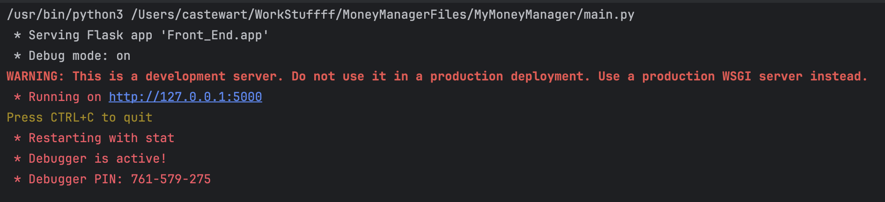

# Semester Project: Money Management System  
## Iteration 5 – Memory Persistence

## Warning:  
Do not change anything in `main.py`, `app.py`, or the `Front_End` directory.  
Don't touch my front end >:(  

---

### System Description  
This iteration expands the *Money Management System* by adding **memory persistence**. This is the idea of maintaining data across runs of the application. This way the data will be loaded automicatically open opening. 

You will implement the functions necessary to store the objects into files. This program will be using JSON files to store the data since they are very similar to Python dictionaries. In order to save the data, you will need to translate the objects into dictionaries then write them to the correct file.

You will also implement the functions necessary to load the objects from a file. The data will be read from the JSON file as a dictionary, which you will need to transalate into the specific classes for this program.

---

### Deliverables  
You are responsible for completing the **TODOs** provided in the project files.  
Each TODO marks a required step to make data operations work for the corresponding feature.

| File | Number of TODOs |
|------|----------------:|
| `budget.py` | 4 |
| `debt.py` | 2 |
| `category.py` | 2 |
| `sinking_fund.py` | 2 |
| **Total** | **10** |

Use PyCharm’s **TODO tool window** to keep track of your progress.  
As you finish each one, replace `TODO` with `DONE` to confirm completion and avoid missing any steps.  

---

### Running the Application  
To run the program:  
1. Open the project in **PyCharm**.  
2. Run the main Flask file.  
3. In the terminal, you should see output similar to the following:  
     
4. In your terminal, click the `http://127.0.0.1:5000` link to open the app in your browser.  

---

### Verifying Your Work  
Once the application is running, ensure that you data persists across runs. The program has been altered to autoload the budget file for the previous month on start up. The datetime library has been included to decide the current and previous months for this purpose.

When you open the application, you should see data autoloaded from October (for most of the project). This data was artifically generated for testing purposes. Test that your code successfully saves newly entered data for the month of November as well by entering new data, closing the application, and restarting it; if the data you entered appears in the application then it has successfully saved from the last run.
---

### Submitting Your Work  
To push your work to your GitHub repository, open the terminal in the project directory and run:  
```
git add .
git commit -m "Solution for Iteration 5"
git push
```
