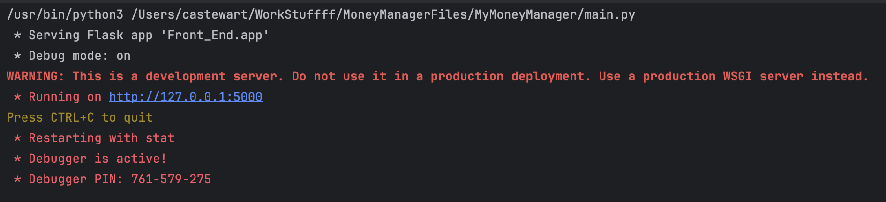

# Semester Project: Money Management System  
## Iteration 1 – User Stories and Use Case Diagram  

### System Description  
For this project, you will design the foundation of a **Money Management System**. This system allows users to record and track their personal finances over time. Users can enter details such as income, expenses, budgets, debts, and funds. The system provides a way to organize these entries and monitor financial health, including how money is earned, spent, and allocated.  

Your goal is not to build the system yet, but to understand its scope through **user stories** and a **use case diagram**. These artifacts will capture what the system should do, who will use it, and how it will be used.  

### Deliverables  
You are responsible for producing the following:  

1. **User Stories**  
   - Write user stories that capture the needs and goals of different users.  
   - Each story must follow a clear format, such as:  
     - *As a \<user\>, I want \<feature\> so that \<benefit\>.*  
     - *As a \<user\>, I need \<feature\> because \<reason\>.*  
   - Stories should demonstrate a robust system by covering a variety of users and features.
   - Stories must be written with a professional tone and clear wording (pretend you will be presenting this to a client).  

2. **Use Case Diagram**  
   - Create a use case diagram that includes **all user stories** you have written.  
   - Each use case should use the story’s title as its label.  
   - The diagram must be proper, clean, and professional, following standard notation.  
   - Focus on correct representation of users (actors), use cases, and their relationships.  

### Grading Criteria  
Your work will be evaluated based on the following loose criteria:  

- **System Robustness**: Does your collection of stories and diagram demonstrate coverage of a realistic, well-rounded system?  
- **Formatting & Tone**: Are the user stories written in the correct format and professional style?  
- **Diagram Quality**: Is the use case diagram properly constructed, clearly labeled, and professional in appearance?  
- **Completeness**: Do the deliverables together give a clear understanding of the system and its functionality?  

## Iteration 2 – Class Diagram  

### System Description  
The Money Management System is designed to represent a person’s finances over the course of a month. At the center is the budget, which brings together all other parts of the system. The budget keeps track of totals, compares actual activity against limits, and produces a complete picture of financial health. To do this, it must organize and use several different kinds of information: day-to-day activity, grouped spending, money owed, and savings goals.  

Transactions form the basic records of financial activity. Each transaction represents either income or an expense and includes details such as an amount and a description. Transactions are connected to the budget so they can contribute to totals, but they are also organized into categories. Categories make it possible to track spending by type, and each one has a spending limit. The system needs to compare the sum of a category’s transactions with its limit in order to show whether the budget is being followed.  

The system also needs to track long-term items that are not just single transactions. Debts represent obligations that must be reduced over time. Each debt stores a total balance and records payments that decrease it, making it possible to show the remaining amount owed. Sinking funds represent savings targets. Each fund has a goal amount and tracks contributions, allowing the system to measure progress toward that goal. Debts and funds can be managed separately, but the budget must also be able to combine them into summaries that show their overall effect on finances.  

The budget acts as the link between these different elements. It gathers information from transactions, categories, debts, and funds, and uses that information to provide totals, remaining balances, summaries, and progress updates. Each element has its own purpose, but the system depends on the connections between them to work as a whole.  

Your task is to represent this structure in a UML class diagram. The diagram should show the main components of the system, the information they contain, and the relationships that connect them. 

### Deliverables  
You are responsible for producing a **Class Diagram** that represents the complete system.  
   - Each class should include attributes and methods that make sense for its role in managing financial data (pull from the project description above).  
   - Relationships between classes must be shown clearly, with correct useage of UML shapes.
   - Multiplicity (e.g., one-to-many, many-to-many) must be included on relationships where it applies.  
   - The diagram should be complete, professional, and easy to read. A diagram submitted without a background or as an unrendered file type (drawio or html) will not be graded.

## Iteration 3 – Backend Implementation  

## Warning: 
Do not change anything in main.pu, app.py, or the Front_End directory. Don't touch my front end >:(.

### System Description  
This iteration transitions the *Money Management System* from design to implementation. You will now begin writing the **backend code** that powers the system you previously modeled in your **UML diagrams and User Stories**.  

The program runs locally on your computer using **Flask**, which hosts the application on your machine rather than on the web. It supports a single user and brings together all parts of the financial system—transactions, categories, debts, and sinking funds—into a working budget manager.  

The front end is completed for you; your job is to work on the backend functionality for those components. The tasks you complete here connect directly to the user stories provided in Iteration 2. Completing these TODOs will demonstrate how your original design decisions translate into working software, showing the clear link between the **design phase** and **development phase** of the project.  

---

### Deliverables  
You are responsible for completing the TODOs provided in the project files.  
Each TODO marks a place where code must be added to complete a portion of the backend system.  

| File | Number of TODOs |
|------|-----------------|
| `budget.py` | 12 |
| `transaction.py` | 2 |
| `category.py` | 2 |
| `debt.py` | 2 |
| `sinking_fund.py` | 2 |

Use PyCharm’s **TODO tool window** to keep track of your progress.  
As you finish each one, replace `TODO` with `DONE`. This helps confirm your progress and makes sure no steps are missed.  

---

### Running the Application  
To run the program:  
1. Open the project in **PyCharm**.  
2. Run the main Flask file.  
3. In the terminal, you should see output similar to the following:  
     
4. In your terminal, click the `http://127.0.0.1:5000` link to open the app in your browser.  
      

---

### Verifying Your Work  
Once the application is running, you should be able to interact with all four areas of the system:  
- **Transactions** – Add new transactions and view them in the list.  
- **Categories** – Add categories and confirm they appear correctly.  
- **Debts** – Add new debts and verify that payment and balance data display properly.  
- **Sinking Funds** – Add funds and check that their progress updates correctly.  

If all four areas can successfully **add** and **display** information without errors, your backend should be functioning correctly.  

---

### Submitting your work

To push your work to the GitHub repository, open your terminal to the project directory and run the commands:
```
git add .
git commit -m "Solution for Iteration 3"
git push
```
